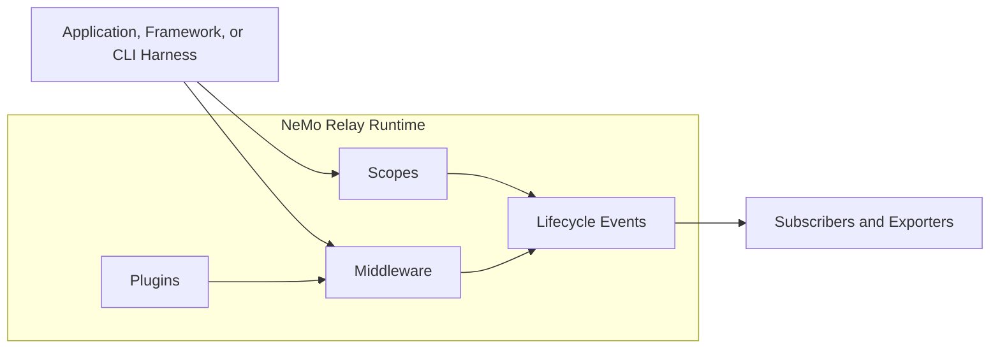

<!--
SPDX-FileCopyrightText: Copyright (c) 2026, NVIDIA CORPORATION & AFFILIATES. All rights reserved.
SPDX-License-Identifier: Apache-2.0
-->

[](https://github.com/NVIDIA/NeMo-Relay/blob/main/LICENSE)
[](https://github.com/NVIDIA/NeMo-Relay/)
[](https://github.com/NVIDIA/NeMo-Relay/releases)
[](https://app.codecov.io/gh/NVIDIA/NeMo-Relay)
[](https://pypi.org/project/nemo-relay/)
[](https://www.npmjs.com/package/nemo-relay-node)
[](https://crates.io/crates/nemo-relay)
[](https://crates.io/crates/nemo-relay-adaptive)
[](https://crates.io/crates/nemo-relay-cli)
[](https://deepwiki.com/NVIDIA/NeMo-Relay)

# NVIDIA NeMo Relay

NVIDIA NeMo Relay provides visibility into and control over agent runs without
requiring changes to the existing agent stack. It gives coding agents,
applications, framework integrations, middleware, and observability backends a
shared runtime for scopes, policy, plugins, and lifecycle events.

For how Relay complements OpenTelemetry GenAI conventions and observability or
evaluation products, see [the Ecosystem guide](https://docs.nvidia.com/nemo/relay/about-nemo-relay/ecosystem).

## Where To Start

| Goal | Start With |
|---|---|
| Observe Codex or Claude Code locally with the CLI | [Quick Start CLI](https://docs.nvidia.com/nemo/relay/nemo-relay-cli/about) |
| Instrument app-owned LLM or tool calls | [Quick Start Application](https://docs.nvidia.com/nemo/relay/getting-started/quick-start) |
| Use LangChain, LangGraph, Deep Agents, or OpenClaw | [Supported Integrations](https://docs.nvidia.com/nemo/relay/supported-integrations/about) |
| Build a framework or provider integration | [Integrate into Frameworks](https://docs.nvidia.com/nemo/relay/integrate-into-frameworks/about) |
| Export ATOF, ATIF, or typed OpenTelemetry projections | [Observability Plugin](https://docs.nvidia.com/nemo/relay/configure-plugins/observability/about) |
| Package reusable middleware or exporters | [Build Plugins](https://docs.nvidia.com/nemo/relay/build-plugins/about) |
| Develop or test this repository from source | [CONTRIBUTING.md](CONTRIBUTING.md) |

Hermes Agent understands NeMo Relay plugin configurations. NeMo Relay is built
into Hermes Agent, so no separate observability plugin or Relay CLI setup is
required.

## Quick Start CLI

Start by recording a real agent run on disk. After Relay writes raw events and a
trajectory file, you have concrete data to inspect, debug, and build on.

### Local Agent Trajectory

This walkthrough shows an end-to-end quick success setup. Install the
NeMo Relay CLI, turn on local exporters, run Codex or Claude Code
through Relay, and check that Relay wrote both raw events and normalized
trajectories.


#### 1. Install the CLI

Install the prebuilt CLI from PyPI:

```bash
pip install nemo-relay-cli-bin
```

Python API users can install the matching CLI through the optional extra:

```bash
pip install "nemo-relay[cli]"
```

Alternatively, run the installer for your platform:

```bash
curl -fsSL https://raw.githubusercontent.com/NVIDIA/NeMo-Relay/main/install.sh | sh
```

```powershell
irm https://raw.githubusercontent.com/NVIDIA/NeMo-Relay/main/install.ps1 | iex
```

Verify that the installed binary is available:

```bash
nemo-relay --version
```

The installer supports Linux x86_64/ARM64, macOS Apple Silicon, and Windows
x86_64/ARM64. Refer to the [installation guide](https://docs.nvidia.com/nemo/relay/getting-started/installation)
for version pinning, custom directories, and source-based installation.

#### 2. Enable Local Observability Output

Open the user-scoped plugin editor:

```bash
nemo-relay plugins edit
```

The editor creates or updates `$XDG_CONFIG_HOME/nemo-relay/plugins.toml` (or
`~/.config/nemo-relay/plugins.toml`). In the top-level menu, select **Observability**,
then configure these sections:

1. Toggle the Observability component on.
2. Open **ATOF**. Toggle the section **[on]**.

   Add a file sink. You can set its `output_directory` to
   `.nemo-relay/atof`, `filename` to `events.jsonl`, and `mode` to
   `overwrite`. Add stream sinks to send the same events to remote collectors.
3. Open **ATIF**. Toggle the section **[on]**.

   Optionally set:
   - `output_directory` to `.nemo-relay/atif`
   - `filename_template` to `trajectory-{session_id}.json`
4. Return to the top-level menu and press `p` to preview the generated TOML.
5. Press `s` to save.

> [!NOTE]
> Repository-local `.nemo-relay/plugins.toml` files are ignored. To use a
> configuration stored elsewhere, pass `--config path/to/config.toml`; Relay
> also selects the sibling `path/to/plugins.toml`.

#### 3. Run a Coding Agent Through Relay

Run the Relay wrapper for the host CLI installed on your machine. For example:

```bash
nemo-relay codex -- exec "Summarize this repository."
```

For Claude Code, run:

```bash
nemo-relay claude -- "Summarize this repository."
```

Refer to the full [Quick Start CLI](https://docs.nvidia.com/nemo/relay/nemo-relay-cli/about) docs for more options.

The transparent wrapper starts a local Relay gateway, injects host-specific hook
and provider settings for that launched process, then shuts the gateway down
when the agent exits.

> [!WARNING]
> The transparent wrapper trusts only the Codex hooks that it generates for the
> launched process. A persistent `nemo-relay install codex` trusts only the
> hooks owned by `nemo-relay-plugin@nemo-relay-local`; manual and source
> marketplace installs can still require review. Restart an open Codex app after
> persistent installation.
>
> On Windows, a restrictive host Job Object can keep the shared Relay gateway
> within the host process lifetime. If the host also rejects the required nested
> assignment, persistent bootstrap stops and explains the conflict. The Codex
> desktop app has additional limitations. Refer to the
> [Codex CLI guide](https://docs.nvidia.com/nemo/relay/nemo-relay-cli/codex) for
> lifecycle, startup, and troubleshooting details.

#### 4. Verify the Run

After the run exits, check that raw events and trajectory files were written.
If the optionally set output directory and file name were used:

```bash
test -s .nemo-relay/atof/events.jsonl
ls .nemo-relay/atif/*.json
for file in .nemo-relay/atif/*.json; do
  python3 -m json.tool "$file" >/dev/null
done
```

Then verify that at least one raw ATOF `0.1` event exists:

```bash
python3 - <<'PY'
from pathlib import Path
import json

events_path = Path(".nemo-relay/atof/events.jsonl")
events = [
    json.loads(line)
    for line in events_path.read_text().splitlines()
    if line.strip()
]

assert events, "no ATOF events were written"
assert any(event.get("atof_version") == "0.1" for event in events), "no ATOF 0.1 events found"
print(f"validated {len(events)} ATOF event(s)")
PY
```

A successful run creates several outputs to inspect:

- `.nemo-relay/atof/events.jsonl` as the raw canonical event stream.
- One or more `.nemo-relay/atif/*.json` trajectory files for analysis and
  evaluation workflows.

> [!TIP]
> If raw ATOF events exist but LLM spans are missing, provider traffic probably
> isn't flowing through the Relay gateway. If ATIF is missing, make sure the
> agent session or turn ended and the output directory is writable.

#### Next Steps

Refer to the full [NeMo Relay CLI](https://docs.nvidia.com/nemo/relay/nemo-relay-cli/about) docs for
persistent host plugin installation, gateway configuration, exporter options,
and agent-specific diagnostics.

> [!TIP]
> Start by trusting the raw Agent Trajectory Observability Format (ATOF) JSONL.
> It shows the lifecycle events Relay actually captured before anything is
> translated into Agent Trajectory Interchange Format (ATIF) or typed
> OpenTelemetry output, including the OpenInference projection.

## Quick Start Applications

If writing the code that calls the model or tool, install the binding for the appropriate
language and route that boundary through Relay directly.

### Application Trajectory

Install Relay for the application language:

```bash
# Python
uv add nemo-relay

# Node.js
# Requires Node.js 24 or newer.
npm install nemo-relay-node@0.8.0

# Rust
cargo add nemo-relay
```

Then run a minimal example workflow for that binding:

- [Python Quick Start](https://docs.nvidia.com/nemo/relay/getting-started/quick-start/python)
- [Node.js Quick Start](https://docs.nvidia.com/nemo/relay/getting-started/quick-start/nodejs)
- [Rust Quick Start](https://docs.nvidia.com/nemo/relay/getting-started/quick-start/rust)


## What Relay Adds

Relay connects agent systems. A production application can
combine NeMo Agent Toolkit, LangChain, LangGraph, provider SDKs, custom harness
code, NeMo Guardrails, tracing systems, and evaluation pipelines. Relay gives
those pieces one runtime contract instead of asking every layer to invent its
own wrappers and trace vocabulary.

Relay gives those systems:

- **Scopes** so runs, turns, tools, LLM calls, and subagents have clear
  ownership, parent-child lineage, cleanup boundaries, and
  request isolation.
- **Managed LLM and tool calls** so the same lifecycle and middleware rules
  apply around each callback.
- **Middleware** for the places where Relay must block, sanitize, transform,
  route, retry, or replace execution.
- **Plugins** so reusable observability, guardrail, adaptive, and exporter
  behavior can be turned on from configuration.
- **Events and subscribers** so raw ATOF, normalized ATIF, and typed
  OpenTelemetry projections all come from the same runtime stream.

Relay does not replace frameworks, model provider, application logic,
observability backend, or guardrail authoring system. It gives those systems a
common boundary to meet.



## Support Status

> [!NOTE]
> The main supported paths today are Rust, Python, and Node.js. Go and raw C FFI
> are available for source-first users, but they are still experimental.

The following table shows which language bindings and CLI features are currently supported:

| Binding | Status | Notes |
|---|---|---|
| Python | Fully supported | Documented with Quick Start and Guides. |
| Node.js | Fully supported | Documented with Quick Start and Guides. |
| Rust | Fully supported | Documented with Quick Start and Guides. |
| NeMo Relay CLI | Supported | Local observability and hook-backed security are supported; optimization is partial and host-dependent. |
| Go | Experimental | Source-first under `go/nemo_relay`. |
| FFI | Experimental | Source-first under `crates/ffi`. |

### Agent Harness Support

The CLI support matrix separates the supported CLI surface from host-specific
coverage.

- Observability works for the listed harnesses.
- Security is supported when the host exposes blocking hooks.
- Optimization remains partial and host-dependent.

| Agent | Observability | Security | Optimization | Notes |
|:--|:--:|:--:|:--:|:--|
| Claude Code | Yes | Yes | Partial | Hook forwarding, pre-tool blocking, and gateway-routed LLM observability are supported. |
| Codex | Yes | Yes | Partial | Persistent install verifies the exact plugin hooks. Each `Stop` finalizes a turn snapshot; the supported generated schema does not install `SessionEnd`. |
| Hermes Agent | Yes | Yes | Partial | NeMo Relay is built into Hermes Agent, and Hermes Agent understands NeMo Relay plugin configurations. No separate observability plugin or Relay CLI setup is required. |

### Public API Integrations

Use these integrations when the framework exposes stable callbacks, middleware,
or plugin hooks that preserve enough lifecycle fidelity.

| Agent / Library | Observability | Security | Optimization | Notes |
|:--|:--:|:--:|:--:|:--|
| LangChain | Yes | Yes | Yes | Wrapped tool and LLM calling. |
| LangGraph | Yes | Yes | Yes | Wrapped tool and LLM calling. |
| Deep Agents | Yes | Yes | Yes | Wrapped tool and LLM calling. |
| OpenClaw | Yes | Partial | No | Hook-backed telemetry with pre-tool guardrails. Public hooks do not expose managed execution rewrites. |

The Python `nemo-relay` package ships extras for LangChain, LangGraph, and Deep
Agents:

```bash
uv add "nemo-relay[langchain,langgraph,deepagents]"
```

Refer to [Supported Integrations](https://docs.nvidia.com/nemo/relay/supported-integrations/about) for setup
guides and current caveats.

## Documentation

End-user documentation lives at
[NVIDIA NeMo Relay documentation](https://docs.nvidia.com/nemo/relay).

Important local entry points:

- [Overview](https://docs.nvidia.com/nemo/relay/about-nemo-relay/overview)
- [Getting Started](https://docs.nvidia.com/nemo/relay/getting-started/quick-start)
- [Installation](https://docs.nvidia.com/nemo/relay/getting-started/installation)
- [Testing and Docs](https://docs.nvidia.com/nemo/relay/contribute/testing-and-docs)

For source builds, tests, and contribution workflow, refer to
[CONTRIBUTING.md](CONTRIBUTING.md).

## Roadmap

- [ ] NemoClaw support and integration for managed tool and LLM execution flows.
- [ ] Deeper NVIDIA NeMo ecosystem integration across agent, guardrail,
      evaluation, and observability workflows.
- [ ] Expanded adaptive optimization capabilities for performance-aware
      scheduling, hints, and cache behavior.
- [ ] First-party plugins and packages for common agent runtimes and frameworks
      where upstream extension points allow it.

## License

NVIDIA NeMo Relay is licensed under the Apache License 2.0.
