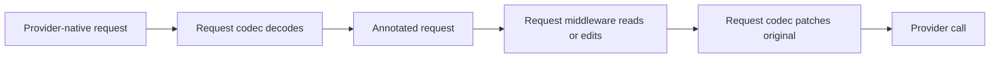
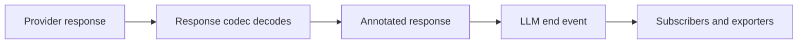

import { MermaidStyles } from "@/components/MermaidStyles";

{/* SPDX-FileCopyrightText: Copyright (c) 2026, NVIDIA CORPORATION & AFFILIATES. All rights reserved.
SPDX-License-Identifier: Apache-2.0 */}

This page explains how codecs fit into the shared NeMo Relay runtime contract.

## Overview

A provider codec translates provider-native LLM request and response payloads
into annotated Relay data. Middleware and observability can then work with
consistent fields without taking control of provider execution. Refer to
[Provider Payload Normalization](/integrate-into-frameworks/provider-codecs) for
implementation guidance.

NeMo Relay also supports
[typed value codecs](/integrate-into-frameworks/using-codecs), which translate
application objects at a public wrapper API.

## Key Features

Provider codecs handle:

- Provider-native LLM request and response payloads
- Request middleware that needs normalized instructions, messages, tools, or
  generation controls
- Events, subscribers, and exporters that need normalized response facts

Without provider codecs, request middleware and observability would need to
parse every provider payload directly.

## Provider Request and Response Codecs

Provider codecs translate provider-native LLM payloads in the request and
response halves of a provider call. First, request codecs decode provider
requests into annotated request data for request intercepts and request-side
middleware, then encode edits back into the provider payload when execution
continues. Later, after the provider returns,
[response codecs](/integrate-into-frameworks/provider-response-codecs) decode provider
responses into annotated response data for LLM end events, subscribers,
exporters, and diagnostics.

Use provider codecs when:

- Provider payloads differ structurally.
- Request intercepts need consistent request fields.
- Response annotations such as usage, model names, or tool calls should be
  exposed through consistent fields for downstream consumers.

<MermaidStyles />

### Request Path

The following diagram shows the request path.



### Response Path

The following diagram shows the response path.



Response decoding improves observability and downstream consistency. It does not
automatically change the value returned to the application unless a separate
typed value codec also does so.

The built-in request codecs are lossless patch codecs. For an unchanged
annotation, the following identity holds at the JSON-value level:

```text
encode(decode(original), original) == original
```

Encoding compares the edited annotation with a freshly decoded baseline and
patches only fields that changed. This preserves caller-selected forms such as
string content versus content blocks, explicit `null` values, legacy field
names, ordered input items, metadata, and unknown fields. Removing a key from
top-level `extra` removes that unknown key from the provider request; adding or
changing a key overlays it.

`AnnotatedLlmRequest` separates portable and provider-specific data:

- `instructions` represents Anthropic `system` and OpenAI Responses
  `instructions`.
- `messages`, content parts, function calls and results, tools, and tool choice
  expose portable components when the provider formats have equivalent meaning.
- `api_specific` is a tagged, mutable field for modeled Anthropic Messages,
  OpenAI Chat Completions, OpenAI Responses, or Gemini `generateContent`
  controls. Response annotations use the same pattern for provider-only
  metadata, including Gemini `generateContent` thinking tokens.
- Provider-only messages, content blocks, input items, tools, and tool choices
  use `{ provider, kind, value }`, where `value` is the exact native JSON.
- Top-level `extra` preserves unknown or unmodeled fields.

A provider-native component can only be encoded by the provider API named
in its `provider` field. Provider mismatches and portable edits that the target
API cannot represent fail before the provider callback.

### Preservation Is Not Semantic Support

Provider APIs can add fields or change semantics before Relay's built-in codecs
are updated. The lossless patch contract preserves unknown fields and
provider-native components when they are unchanged, which keeps newer payloads
from being discarded. That pass-through behavior does not mean Relay
understands, validates, or can portably edit those fields.

Semantic support is limited to the provider fields modeled by the current codec
implementation. New provider behavior requires a codec and test update before
middleware or exporters should rely on its normalized meaning.

## Typed Value Codecs

Typed value codecs serve a different purpose. They translate
application-facing objects to and from JSON-compatible values when application
code or framework callbacks need native types but Relay events and middleware
need a stable serialized payload. Refer to
[Using Codecs](/integrate-into-frameworks/using-codecs) for implementation
guidance.

## Where Normalized Data Is Used

Several parts of Relay use normalized codec output:

- Request intercepts or request-side middleware that need consistent request fields
- Lifecycle events that should expose consistent semantic payloads
- Subscribers that inspect runtime activity in process
- Exporters that write raw ATOF events or project them into ATIF or typed
  OpenTelemetry output

Codecs do not replace scopes, middleware, subscribers, or plugins. They make
those layers easier to apply consistently across provider-specific inputs.

## Extraction Responsibilities

NeMo Relay separates extraction responsibilities so normalization logic can be
reused without changing public binding APIs.

### Provider Schema Extraction

Provider codecs extract provider schema fields. The built-in codecs for OpenAI
Chat Completions, OpenAI Responses, Anthropic Messages, and Gemini
`generateContent` recognize their request and response payloads and map them
into `AnnotatedLlmRequest` or `AnnotatedLlmResponse`.

When a managed LLM event already has an annotation, subscribers and exporters
consume that annotation. When an event has only raw provider JSON, best-effort
normalization can detect a built-in provider codec and decode it. This
fallback is fail-open: unrecognized, ambiguous, missing, sparse, or invalid
payloads remain observable as raw lifecycle data. A recognized provider hint can
disambiguate an otherwise identical request payload, such as an Anthropic Messages
request without a top-level `system` field, but no provider annotation is
invented without either a matching provider codec or a recognized hint.

Provider extraction covers model names, instructions, messages, generation
parameters, tool definitions, tool calls, finish reasons, usage, cost,
provider-specific fields, and replayable request or response JSON when the
source payload contains enough information. Provider codecs preserve unknown
fields and treat request encoding as a baseline-aware patch over the original
provider payload.

The response-extraction interface is the existing response codec contract:
`LlmResponseCodec::decode_response` returns `AnnotatedLlmResponse`. Built-in
codecs populate that normalized response with model, finish reason, tool-call,
usage, cost, provider-specific, and preserved `extra` fields. Cost parsing and
estimation helpers are codec implementation details behind that interface, not a
separate provider-response API.

### Gateway Request Extraction

The gateway extracts route-specific request facts. It uses the selected route,
such as OpenAI Responses, OpenAI Chat Completions, OpenAI Models, Anthropic
Messages, or Anthropic Count Tokens, to extract request facts that are not codec
schema annotations.

Route-specific request extractors resolve gateway session IDs, request-affinity
keys, and fallback turn input for provider calls that arrive before the matching
agent prompt hook. This keeps correlation and routing hints in the gateway
routing logic, while provider codecs stay focused on request and response
schemas.

Provider request extraction can also pass a narrow provider hint into codec
normalization. For example, the recognized `anthropic` and `anthropic.messages`
hints let Anthropic Messages requests without a top-level `system` field decode
through the Anthropic codec instead of being inferred as OpenAI Chat payloads
from their fields alone.

The `nemo-relay` gateway always enables matching OpenAI Chat, OpenAI Responses,
and Anthropic Messages request codecs for the provider generation routes it
proxies: `/v1/messages`, `/v1/chat/completions`, and `/v1/responses`, for both
buffered and streaming execution. Gemini `generateContent` does not yet have a
gateway route, so `GeminiGenerateContentCodec` is available for direct framework
use rather than gateway auto-selection. Count-token, model, probe, and non-LLM
passthrough routes do not enable request codecs automatically. Gateway request
intercepts must therefore edit generation bodies through `annotated_request`;
raw `request.content` remains writable on routes without a request codec.

### Agent Payload Extraction

Agent payload extraction is separate from provider codecs. Coding agents,
harnesses, and framework hooks can expose session IDs, event names, subagent
relationships, tool IDs, tool names, tool arguments, tool results, LLM hints,
and status fields through host-specific payload formats. These facts help NeMo
Relay attach lifecycle events to the right scope, but they do not decode
provider schemas or build request-affinity keys from provider requests.

Agent extraction may be partial. Missing identifiers use compatibility
fallbacks in the adapter, such as synthetic session IDs, synthetic tool
call IDs, an explicit `unknown_tool` name, or a generic subagent ID. Lossy,
summary-only, or truncated payloads should keep their original payload and
metadata available for debugging instead of presenting them as complete provider
data.

### Exporter Projection

Exporter projection is the final step. ATIF and the typed OpenTelemetry
projections can map the same normalized facts into different output schemas,
but generic extraction should stay outside exporter-specific formatting where
possible. ATIF-specific trajectory shaping and each OpenTelemetry projection's
semantic attributes remain exporter-local.

## Codec Decision Limitations

Codecs do not decide:

- Which scope owns the call
- Middleware ordering
- Whether execution is allowed to continue
- Which exporter is active

Those responsibilities belong to scopes, middleware, plugins, and exporter or
subscriber registration.
