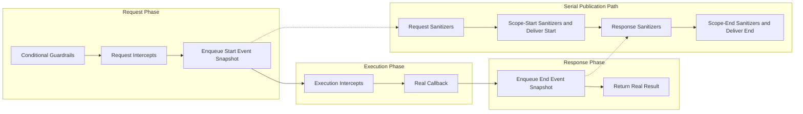
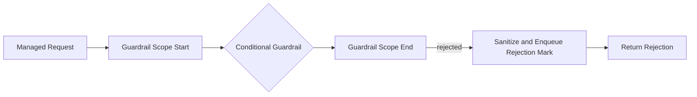
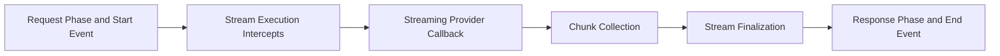

import { MermaidStyles } from "@/components/MermaidStyles";

{/* SPDX-FileCopyrightText: Copyright (c) 2026, NVIDIA CORPORATION & AFFILIATES. All rights reserved.
SPDX-License-Identifier: Apache-2.0 */}

This page explains the runtime behavior that runs around managed tool and LLM
calls and sanitizes emitted mark and scope events.

## What Middleware Is

Middleware controls or transforms tool and LLM execution and sanitizes emitted
events. NeMo Relay applies each middleware type at a specific lifecycle point.

Middleware is organized by lifecycle meaning rather than as one undifferentiated
hook system.

## Asynchronous Callbacks

All middleware families are asynchronous in the Rust runtime. Rust callbacks
return a future, and Node callbacks may return a value or a Promise. Python
registrations accept callbacks that return a value or an awaitable when invoked
through an asynchronous Relay API or queued event publication. Worker and
native-plugin middleware can also complete asynchronously. Within each
middleware chain, Relay awaits entries sequentially in priority order so later
callbacks observe earlier middleware output. Payload and event sanitizer chains
run on the queued publication path and do not delay managed execution.

The experimental raw C FFI and Go binding retain synchronous middleware
callbacks. Relay invokes each callback on a native thread and waits for it to
return, so blocking I/O or other long-running work occupies that thread and can
reduce middleware throughput. There is no completion-based C or Go middleware
registration API.

Synchronous standalone Python calls cannot drive an awaitable callback. Call
the same standalone helper from a running event loop and await the returned
value instead.

Managed execution is asynchronous because its result depends on conditional
guardrails and intercept completion. Python standalone conditional and
request-intercept helpers return a direct value outside an event loop and an
awaitable inside one. Managed and manual lifecycle APIs queue observability
sanitization and publication rather than awaiting it. Manual lifecycle APIs
(`tool_call`, `tool_call_end`, `llm_call`, and `llm_call_end`) remain
synchronous and create or close their handle immediately.

<Warning>
Event sanitizers, conditional-execution guardrails, request intercepts,
execution intercepts, and subscribers are not re-entrant. These callbacks must
not invoke another NeMo Relay API that runs middleware, flushes subscriber
delivery, waits on an exporter, or clears plugins. Scope APIs remain supported:
callbacks may create, push, or pop scopes at any nesting level and may replace
the active scope stack with an arbitrary stack. Emitting a new event is the
only supported operation that can enqueue additional callback work; Relay
queues that event for later publication instead of recursively dispatching it.
An event sanitizer must await child tasks whose emissions belong to its
reserved FIFO position. Relay cancels detached async sanitizer tasks after the
sanitizer returns. Detached blocking work runs without that sanitizer
publication context and must not emit events for the completed publication.

An execution intercept may invoke the `next` continuation supplied to that
callback. This is the only supported way for an intercept to enter the
remaining execution chain. The callback may await `next` repeatedly or
concurrently for retries or fan-out. Each call receives an isolated snapshot of
the scopes visible when it begins, so scope changes in one branch do not mutate
another branch or the enclosing interceptor. Every `next` call must finish
before the interceptor callback settles; unfinished or later calls are
rejected. For a streaming execution intercept, the interceptor's returned
stream extends that active lifetime until it closes, so a lazy stream adapter
can call `next` while it is being consumed. A stream successfully returned by
streaming `next` keeps its ordinary stream lifetime.

A tool execution continuation returns `ToolExecutionResult`, which contains the
application-owned `result` and an optional opaque `annotation`. A forwarding
intercept must preserve both fields in its `ToolExecutionInterceptOutcome` or
deliberately replace or remove the annotation. Relay retains pending marks
separately from this application-visible result.
</Warning>

## Registration Levels

Middleware and subscribers can be registered at different levels depending on their
lifetime and visibility.

### Global Registrations

Global registrations stay active for the whole process until they are removed.
Use them for defaults that should apply broadly.

### Scope-Local Registrations

Scope-local registrations are owned by one active scope and disappear
automatically when that scope closes.

Use them when behavior should stay local to one request, workflow, or nested
unit of work.

### Plugin-Installed Registrations

Plugins can install middleware during initialization. This is the reusable,
configuration-driven path for shipping middleware bundles without hand-registering
everything in application code.

## Middleware Families

NeMo Relay has two major middleware families with three distinct purposes:

- **Intercepts** change the real request or callback execution path.
- **Conditional-execution guardrails** decide whether the real work runs.
- **Sanitize guardrails** change emitted observability without changing the real
  request or result.

## Choose a Middleware Type

Choose the middleware type that matches the behavior you need:

- Use a **conditional-execution guardrail** when the work should be allowed or
  rejected.
- Use a **request intercept** when the real request must change before the call.
- Use an **execution intercept** when code must run before or after the callback.
- Use a **sanitize guardrail** when only subscribers and exporters should see
  rewritten data.
- Use a **mark or scope event sanitizer** when the sensitive fields are in
  `data`, `category_profile`, or `metadata` rather than the managed tool or LLM
  request or response payload.
- Use a **stream execution intercept** when behavior must wrap chunk delivery,
  finalization, cancellation, or cleanup for a streaming LLM response.

## Callback Error Handling

Conditional-execution guardrails and request or execution intercepts fail
closed when their callbacks return a failure result. A failure returned
directly or produced when a callback raises an exception or rejects a `Promise`
stops Relay at that middleware stage, and Relay surfaces the failure to the
managed caller. A conditional guardrail or request intercept therefore prevents
the real callback from running when it fails. Separately, a
conditional-execution guardrail can return its documented rejection message to
block execution. A rejection is normal control flow, not a callback failure. An
execution intercept cannot undo work from a `next` continuation that it already
invoked. This fail-closed contract is the same whether the callback completes
directly or asynchronously.

## Intercepts

Intercepts are middleware that change the real request or execution path.

### Request Intercepts

Request intercepts rewrite the real request before execution continues.

Use them when the next stage of execution should receive changed input, such as:

- Header injection
- Request normalization
- Argument enrichment
- Provider-specific request rewriting

### Execution Intercepts

Execution intercepts wrap or replace the real callback.

Use them when code must run before or after the callback, such as:

- Retries
- Timing
- Routing
- Wrapper logic
- Framework integration

### Stream Execution Intercepts

LLM streaming has a stream execution path for wrappers that need to run around
chunk delivery and finalization rather than only around a single response
object.

## Guardrails

Guardrails are middleware that block execution or sanitize observability payloads.

Sanitizers are pure transformations. Do not use a sanitizer callback for
stateful side effects, such as metrics, logging, mutation, or I/O; Relay only
guarantees the transformed observability payload.

### Conditional Execution

Conditional-execution guardrails run before the real callback. They decide
whether execution may proceed.

Use them when the runtime should block work based on policy, budget, or context.

### Sanitize Request

Sanitize-request guardrails rewrite the payload recorded on emitted start events.

Use them when the event stream should hide or reduce sensitive request data.

### Sanitize Response

Sanitize-response guardrails rewrite the payload recorded on emitted end events.

Use them when the event stream should hide or reduce sensitive response data.
For tools, this guardrail receives only `ToolExecutionResult.result`. Sanitize
the projected `category_profile.tool_result_annotation` with a scope-end event
sanitizer instead.

### Sanitize Mark and Scope Events

Event sanitizers cover observability fields that are outside the specialized
tool and LLM payload APIs. Separate registries apply to marks, scope starts,
and scope ends. They can rewrite `data`, `category_profile`, and `metadata`
while receiving the complete event as immutable context.

Scope event sanitizers run for every delivered event category. On tool and LLM
scope events, they run after the specialized request or response sanitizer.
Mark sanitizers cover delivered explicit marks and marks materialized by
middleware, plugins, and streaming lifecycle helpers.

Register event sanitizers globally, on an owning scope, or through a plugin
context. For the callback contract and binding APIs, refer to
[Event Sanitizers](/reference/event-sanitizers).

Sanitize guardrails are observability-oriented. They do not rewrite the real
arguments passed to the callback or the real value returned to the caller.

## Queued Event Publication

Scope operations, marks, and manual or managed tool/LLM lifecycle calls do not
await observability sanitizers. At emission time Relay snapshots the event-only
payload, visible sanitizer chains, and subscribers, then places the work on a
serial dispatcher. The dispatcher awaits the specialized tool or LLM payload
sanitizers, then the event sanitizers, and publishes the event later in FIFO
order.

Subscriber and exporter delivery is therefore delayed, while start/end/mark
order is preserved. Closing a scope or deregistering middleware after emission
does not affect queued snapshots. Sanitizer failures fail closed: Relay records
the callback failure and withholds the governed observability payload.

## Managed Execution Order

Tool calls and buffered LLM calls follow one normal path grouped into request,
execution, and response phases.

<MermaidStyles />



The phases run as follows:

1. **Request phase:** Conditional-execution guardrails allow the call, request
   intercepts rewrite the real request, and Relay snapshots and enqueues the
   start event's observability copy.
2. **Execution phase:** Execution intercepts wrap or replace the real callback.
3. **Response phase:** Relay snapshots and enqueues the end event's
   observability copy, then returns the real result.
4. **Publication path:** The serial dispatcher runs request or response
   sanitizers, then the matching scope-event sanitizers, and finally delivers
   the event to subscribers and exporters.

The start event is submitted before execution begins, but its sanitizers run
later on the publication path and may overlap application execution. The serial
dispatcher preserves start/end delivery order, and `flush_subscribers()` waits
for queued sanitization and delivery when a caller needs that barrier.

This ordering preserves the distinction between the families:

- Use an intercept to change real execution.
- Use a sanitize guardrail to change only emitted observability.

### Rejection Path

A conditional-execution guardrail can reject the call during the request phase.
Relay emits a guardrail scope start/end pair for each conditional guardrail it
evaluates. If a guardrail rejects the call, Relay skips the managed call start
and end events and does not run request intercepts, execution intercepts, or the
real callback. It then sanitizes and enqueues the rejection mark before
returning the rejection to the managed caller.



### Streaming LLM Path

For streaming LLM flows, the same pre-execution order applies: the runtime
applies request sanitizers and emits the LLM start event before the
stream execution intercept chain runs. Stream execution intercepts are the
execution family for streaming provider callbacks. The runtime then collects
chunks and finalizes the stream before response sanitizers rewrite
the emitted end-event payload and scope-end event sanitizers run.



Before LLM request sanitizers run, Relay removes standard credential headers
from the event-only request copy: `authorization`, `proxy-authorization`,
`cookie`, `x-api-key`, `api-key`, `anthropic-api-key`, and `x-goog-api-key`.
Header-name matching is case-insensitive. This protects sanitizer callbacks,
subscribers, and exporters without changing the request sent to the provider.
Configure a PII sanitizer for custom credential header names.

## Codec-Aware LLM Sanitizers

Every LLM sanitize guardrail receives the payload first and a required
directional, per-call context second:

```text
request:  (LlmRequest, LlmSanitizeRequestContext) -> Option<LlmRequest>
response: (Json, LlmSanitizeResponseContext) -> Option<Json>
```

`context.codec` is a binding-native codec identity, not a JSON payload.
Python and Node.js expose `kind` and, when applicable, `id` properties.
In-process Rust and the typed native Rust SDK expose enum variants. The raw
native ABI exposes the same information through `codec_kind` and `codec_id`.

`codec.kind` is `none` for a call with no codec, `builtin` for
Relay's built-in `openai_chat`, `openai_responses`, `anthropic_messages`, `oci_genai`, and
`gemini_generate_content`
codecs, `runtime` for a named runtime-registered codec, and `opaque` for an
active codec without a registered identity. `codec.id` is present only for
`builtin` and `runtime`. Do not infer a provider from an opaque request shape.

Return a payload to continue the sanitizer chain. Return `None` (or `null` in
JavaScript) only when observing the payload would be unsafe: Relay omits the
LLM event payload and its annotation, while leaving the client-visible request
and response unchanged. Omission short-circuits later LLM sanitizers.

All LLM sanitizer callbacks must implement this two-parameter contract. For an
in-process sanitizer, use `resolve_codec()` to access the active codec
implementation. A resolver returns no codec for manual calls without one.
Worker-plugin contexts resolve to an invocation-scoped asynchronous proxy with
the same directional operations: request codecs provide `decode(request)` and
`encode(annotated, original)`, while response codecs provide `decode(response)`.
Python in-process response codecs expose that operation as `decode_response`,
and Node.js exposes it as `decodeResponse`. An active runtime or opaque codec
resolves just like a built-in codec; its identity does not limit the available
operations. Node.js codecs supplied through decode and encode callbacks have
an `opaque` identity but remain resolvable. The worker proxy is valid only
while its sanitizer callback is running; do not retain it after the callback
returns.

<Tabs>
<Tab title="Python" language="python">

```python
import nemo_relay
from nemo_relay import LLMRequest
from nemo_relay import guardrails

def redact_request(
    request: LLMRequest,
    context: nemo_relay.LlmSanitizeRequestContext,
) -> LLMRequest | None:
    codec = context.resolve_codec()
    if (
        context.codec.kind == "builtin"
        and context.codec.id == "openai_chat"
        and codec is not None
    ):
        annotated = codec.decode(request)
        # Apply a policy to the normalized request, then preserve the wire shape.
        annotated.messages = []
        return codec.encode(annotated, request)
    return request

guardrails.register_llm_sanitize_request("redact-openai-chat", 10, redact_request)
```

</Tab>
<Tab title="Node.js" language="javascript">

```js
const relay = require("nemo-relay-node");

relay.registerLlmSanitizeRequestGuardrail(
  "redact-openai-chat",
  10,
  (request, context) => {
    const codec = context.resolveCodec();
    if (codec) {
      const annotated = codec.decode(request);
      annotated.messages = [];
      return codec.encode(annotated, request);
    }
    return request;
  },
);
```

</Tab>
<Tab title="Rust" language="rust">

```rust
use std::sync::Arc;
use nemo_relay::api::runtime::{BuiltinLlmCodec, LlmCodecIdentity};
use nemo_relay::api::registry::register_llm_sanitize_request_guardrail;

register_llm_sanitize_request_guardrail(
    "redact-openai-chat",
    10,
    Arc::new(|mut request, context| {
        Box::pin(async move {
            if context.codec() == &LlmCodecIdentity::BuiltIn(BuiltinLlmCodec::OpenAiChat)
                && let Some(codec) = context.resolve_codec()
                && let Ok(mut annotated) = codec.decode(&request)
            {
                annotated.messages.clear();
                if let Ok(encoded) = codec.encode(&annotated, &request) {
                    request = encoded;
                }
            }
            Ok(Some(request))
        })
    }),
)?;
```

</Tab>
</Tabs>

The same registration names support scope-local and plugin-context
registrations. Priority and name tie-break ordering are unchanged.

## Practical Guidance

Use these practices when applying the concept in application or integration code.

- Keep process-wide defaults global.
- Keep request-local policy scope-local.
- Use plugins when the middleware bundle should be reusable and
  configuration-driven.
- Treat execution intercepts as the preferred wrapper point for framework
  integrations.
