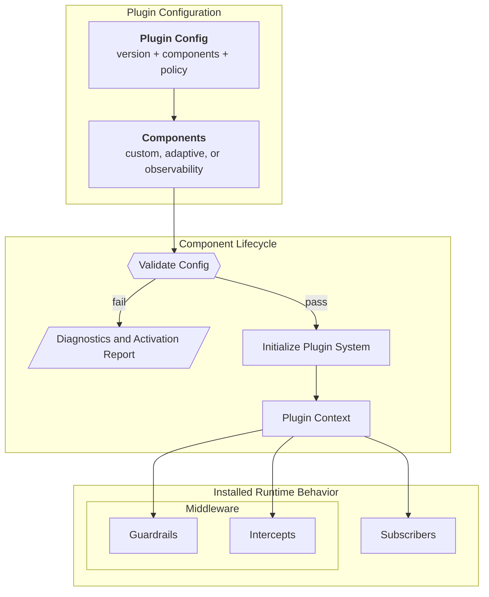

import { MermaidStyles } from "@/components/MermaidStyles";

{/* SPDX-FileCopyrightText: Copyright (c) 2026, NVIDIA CORPORATION & AFFILIATES. All rights reserved.
SPDX-License-Identifier: Apache-2.0 */}

This page explains how plugins package reusable runtime behavior behind configuration.

## Why Plugins Exist

Plugins let NeMo Relay install reusable runtime behavior from configuration
instead of requiring every application or framework integration to register the
same middleware and subscribers by hand.

Plugins package reusable runtime components.

## Plugin Configuration Model

A plugin configuration document has three main areas:

- `version`
- `components`
- `policy`

### Version

The version identifies the configuration format expected by the plugin system.

### Components

Components identify the runtime behavior to activate. Each component declares
its kind and configuration.

### Policy

Policy controls how strictly the plugin system interprets unknown fields,
unsupported values, or compatibility issues.

Two similarly named files serve different purposes:

| File | Owner | Purpose |
| --- | --- | --- |
| `plugins.toml` | Relay operator or application | Configures built-in components and records references to discoverable plugins. Relay discovers and layers this file. |
| `relay-plugin.toml` | Discoverable plugin author | Describes one packaged native library or worker, including compatibility, capabilities, loading, and integrity. Relay reads it through a reference in `plugins.toml`. |

Refer to [Plugin Configuration Files](/configure-plugins/plugin-configuration-files)
for runtime configuration and
[Discoverable Plugins](/build-plugins/dynamic-plugins/about) for the package
manifest.

## Component Lifecycle

Relay validates plugin configuration before it activates any component.

### Validation

Validation checks whether the supplied config is structurally and semantically
acceptable before initialization.

### Initialization

Initialization activates the configured components and registers their runtime
behavior.

### Activation Reporting

Reporting provides structured diagnostics about what activated successfully and
what did not.

### Deactivation and Cleanup

Relay tracks registrations created during plugin initialization. Clearing active
plugin configuration removes those registrations and runs component cleanup.
Dynamic plugin teardown also stops managed workers and releases native
activations after their callbacks are no longer registered. Applications should
clear plugin configuration during graceful shutdown and test teardown. Refer to
[Register Plugin Behavior](/build-plugins/language-binding/register-behavior)
for the binding lifecycle.

### Setup Failures

Plugin validation and initialization happen during setup. If configuration is
invalid, a component kind is unavailable, or initialization fails, callers
should treat setup as failed before relying on the new runtime behavior.
Activation reports are the public way to inspect what validated or activated.

Runtime behavior after activation still belongs to the installed component. For
example, an exporter can report delivery failures without changing tool or LLM
execution semantics. Keep those component-specific failure rules in the
component guide rather than redefining them in the plugin concept.

<MermaidStyles />

## Plugin Context

The plugin context is the API that a component uses to register its behavior.
It connects plugin configuration to the active runtime.

## What Plugins Can Register

Depending on the component, a plugin can register:

- Middleware
- Subscribers
- Related runtime helpers

This is what makes plugins a packaging mechanism rather than a separate runtime
model. Plugins do not replace scopes, middleware, or subscribers. They install
them.

## Ownership and Scope

Plugin initialization is process-level. It is intended for runtime components
that should remain active across requests in one process. It is not permanent as
clearing or replacing the active plugin configuration removes plugin-owned
runtime behavior.

Scope-local behavior still matters after plugin installation, but the plugin
system itself is a global activation layer.

Plugins install runtime behavior; they do not create a separate execution
model. Scopes still own parentage and cleanup, middleware still owns execution
ordering, and events still own the canonical runtime record.

## Plugin Delivery Models

All plugin components use the same validation and activation model. They differ
in how their component kind becomes available to the host:

| Delivery model | How it becomes available | Use when |
| --- | --- | --- |
| Built-in | The Relay host registers a linked first-party component automatically. | The component ships as part of that host. |
| Host-registered | An embedding application links a component crate and registers its kind before validation. | An embedding application decides which component crates to link. |
| Discoverable | The CLI loads a manifest-backed native library or worker at startup. | A separately packaged extension should be installed without rebuilding Relay. |

## Built-In Plugin Components

The core runtime registers the `observability`, `nemo_guardrails`, and
`pricing` components before lookup, validation, and initialization. The CLI and
the Python and Node.js bindings also register `adaptive` and `pii_redaction`.
Direct Rust applications must register Adaptive and PII Redaction from their
component crates before validating or initializing either kind:
`nemo_relay_adaptive::plugin_component::register_adaptive_component()` and
`nemo_relay_pii_redaction::component::register_pii_redaction_component()`.
Applications can still register custom plugins.

### Adaptive

Adaptive is implemented as a built-in plugin component. It is not a separate
runtime model. It uses the same plugin system as custom components.

This matters conceptually because adaptive behavior is configured and activated
through the same component lifecycle as other plugins. Direct Rust applications
follow this sequence:

1. Call `nemo_relay_adaptive::plugin_component::register_adaptive_component()`.
2. Validate the config.
3. Initialize the plugin system.
4. Inspect the activation result if needed.

Detailed adaptive configuration belongs in
[Adaptive Configuration](/configure-plugins/adaptive/configuration),
[Adaptive Cache Governor (ACG)](/configure-plugins/adaptive/acg), and
[Adaptive Hints](/configure-plugins/adaptive/adaptive-hints).

### Observability

The core crate ships a built-in `observability` plugin component for Agent
Trajectory Observability Format (ATOF), Agent Trajectory Interchange Format
(ATIF), and typed OpenTelemetry exporters. Each exporter section is disabled
unless its section sets `enabled = true`, and subscriber names are inferred
from the plugin namespace instead of exposed in public config.

Detailed observability plugin configuration belongs in
[Observability Configuration](/configure-plugins/observability/configuration).

### NeMo Guardrails

The core crate also ships a built-in `nemo_guardrails` plugin component. The
built-in integration is deprecated and scheduled for removal in NeMo Relay
0.9. There is no replacement in NeMo Relay 0.8; any replacement will target 0.9
or later. Do not use the built-in component for new deployments.

The current shipped user-facing paths are:

- The remote backend for Guardrails-service integration
- The Python-backed local backend for `nemoguardrails` integration through a
  subprocess worker

Detailed Guardrails plugin configuration belongs in
[NeMo Guardrails Configuration](/configure-plugins/nemo-guardrails/configuration).

### PII Redaction

The `pii_redaction` component sanitizes emitted observability payloads without
changing real callback arguments or results. The CLI and primary language
bindings register this component. Direct Rust applications must call
`nemo_relay_pii_redaction::component::register_pii_redaction_component()`
before they validate or initialize a PII Redaction component.

Configure actions, detectors, targets, and backend modes through [PII Redaction
Configuration](/configure-plugins/pii-redaction/configuration).

### Model Pricing

The core crate ships a built-in `pricing` component. It loads catalog sources
that response codecs can use to annotate managed LLM responses with cost
estimates. Configure catalog sources through [Model Pricing](/configure-plugins/model-pricing).

### Switchyard (Experimental)

The experimental `switchyard` component asks a separately running Switchyard
Decision API to select a configured model backend. It is excluded from default
CLI builds and is registered only when the CLI is built with the optional
`switchyard` feature. Direct Rust, Python, and Node.js hosts do not register it
automatically. Refer to
[Switchyard (Experimental)](/configure-plugins/switchyard/about) for the pinned
compatibility and deployment requirements.

For `plugins.toml` discovery, precedence, merge, and gateway editing rules,
refer to [Plugin Configuration Files](/configure-plugins/plugin-configuration-files).

## Discoverable Plugins

Discoverable plugins use the same component lifecycle, but the CLI reads a
`relay-plugin.toml` manifest before it creates an internal component. The
manifest identifies a Rust native shared library or a local `grpc-v1` worker,
declares compatibility and capabilities, and supplies integrity evidence for
the artifact.

The operator keeps the manifest reference and component configuration in
`plugins.toml`. Use `nemo-relay plugins validate <plugin-id>` to check the
manifest, optional static schema, host policy, compatibility, and trust
evidence before enabling or running a dynamic plugin. During startup, Relay
loads the enabled adapter and then validates the synthesized component. Refer
to [Configure Discoverable Plugins](/configure-plugins/discoverable-plugins)
for the operator workflow and [Discoverable Plugins](/build-plugins/dynamic-plugins/about)
for the authoring workflow.

The operator lifecycle is explicit:

1. `nemo-relay plugins add <manifest>` records the manifest and prepares managed
   worker resources when required.
2. `nemo-relay plugins inspect <plugin-id>` reads the stored registration and
   resolved manifest without changing desired state.
3. `nemo-relay plugins validate <plugin-id>` checks compatibility, schema,
   policy, and trust evidence.
4. `nemo-relay plugins enable <plugin-id>` changes desired state; the plugin
   loads during the next host startup.
5. `nemo-relay plugins disable <plugin-id>` keeps the registration but prevents
   it from loading on the next startup.
6. `nemo-relay plugins remove <plugin-id>` deletes the registration and any
   Relay-managed worker environment after the running host has stopped.

These commands manage future host activation. Teardown of an already running
host remains part of that host's owned plugin cleanup.

## Practical Guidance

Use these practices when applying the concept in application or integration code.

- Use plugins when behavior should be reusable across applications or
  integrations.
- Validate plugin config before initialization.
- Treat plugins as the configuration-driven installation path for runtime
  behavior.
- Keep detailed field-by-field config questions in the relevant guide for that plugin component.
