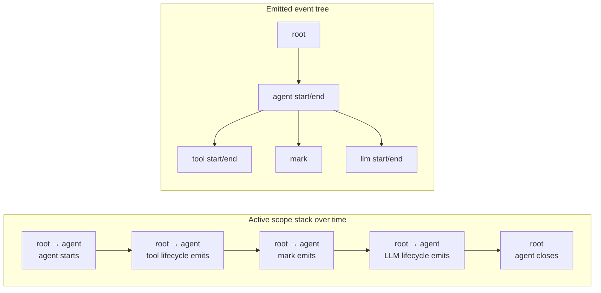

import { MermaidStyles } from "@/components/MermaidStyles";

{/* SPDX-FileCopyrightText: Copyright (c) 2026, NVIDIA CORPORATION & AFFILIATES. All rights reserved.
SPDX-License-Identifier: Apache-2.0 */}

This page explains how scope stacks establish ownership, parentage, cleanup, and
isolation.

## Why Scopes Exist

Scopes track where work belongs in NeMo Relay. Every tool call, LLM call, and
mark event attaches to a scope hierarchy.

That hierarchy lets the runtime:

- Model nested agent work
- Preserve parent-child relationships
- Expose scope-local middleware and subscribers
- Clean up scope-owned runtime state automatically
- Isolate concurrent work

## What a Scope Represents

A scope represents a logical unit of work such as:

- An agent run
- A request
- A workflow step
- A background task
- A nested function or tool workflow

Scopes are not just labels. They determine event parentage and which local
middleware and subscribers are visible.

## Scope Hierarchy and Ownership

Scopes form a tree. A child scope inherits the active context from its
parent and contributes new nested work beneath it.

That hierarchy determines:

- Event parentage
- Lifetime boundaries
- Scope-local middleware visibility
- Scope-local subscriber visibility

## Scope Types

NeMo Relay includes standard scope types for common runtime semantics, including:

- `Agent`
- `Function`
- `Tool`
- `Llm`
- `Retriever`
- `Embedder`
- `Reranker`
- `Guardrail`
- `Evaluator`
- `Custom`
- `Unknown`

The specific type helps subscribers and downstream tracing systems understand
what the scope represents semantically.

## Scope Behavior

These scope behaviors define how root, child, and scope-local runtime state interact.

### Root Scope

A root scope is always present. Other scopes are pushed beneath that root as
work becomes more specific.

### Parent-Child Relationships

Nested scopes create the ownership tree used by emitted events. Tool and LLM
calls then attach beneath the active scope.

### Scope Lifetimes

Scopes have explicit lifetime boundaries. A scope starts when it becomes active
and ends when it is popped or closed.

### Scope-Local Cleanup

Scope-local middleware and subscribers are tied to the owning scope lifecycle.
When the scope closes, those registrations disappear automatically.

## Worked Scope Lifetime

Consider an agent that calls one tool and then one LLM:

1. The application or framework integration pushes an `Agent` scope beneath the
   root and emits its start event.
2. The application registers middleware and a subscriber on the agent scope.
   Both are visible while the agent or any of its nested scopes are active.
3. A managed tool wrapper emits the tool start event, runs the tool, and emits
   the tool end event. The agent remains the active scope.
4. The application emits a mark under the active agent scope. The mark does not
   change the stack.
5. A managed LLM wrapper emits the LLM start event, runs the model call, and
   emits the LLM end event. The agent remains the active scope.
6. The application or framework integration emits the agent end event and pops
   the agent scope. Its local
   middleware and subscriber are removed.

The active scope stack changes over time. The emitted events remain in a
parent-linked tree after their scopes close. A mark event attaches beneath the
active scope but does not push another scope onto the stack.

<MermaidStyles />



Agent-local middleware and subscribers are visible during the first four stack
states. They are no longer visible after the agent scope closes.

## Semantic Payloads

Scopes may expose semantic `input` and `output` payloads on their emitted start
and end events.

### Scope Input

Use scope `input` when the scope itself represents a request-style or task-style
unit of work whose starting payload matters semantically.

### Scope Output

Use scope `output` when the scope itself produces a meaningful semantic result.

Those payloads live on the emitted events rather than on the scope handle
itself.

## Context Isolation

Context isolation keeps concurrent requests, tenants, and agents from sharing scope-
local state accidentally.

Choose the context behavior based on whether the work belongs to the same
logical trace and whether it runs concurrently:

| Work | Context Behavior |
| --- | --- |
| Sequential nested work in the same trace | Reuse the active stack |
| Concurrent branches in the same trace | Fork the stack for each branch |
| Independent work | Start with a fresh isolated stack |
| Same-trace work crossing a process boundary | Carry Relay propagation context; scope-local registrations do not cross the boundary |
| Independent work crossing a process boundary | Start with a fresh isolated stack instead of importing context |

### Why Isolation Matters

Concurrent requests must not share the same active scope stack accidentally.
Otherwise:

- Unrelated work can appear under the wrong parent
- Scope-local middleware can leak across requests
- Scope-local subscribers can observe the wrong execution tree

## Reuse an Existing Logical Trace

Reuse or propagate the active scope stack when detached work should continue the
same logical request or agent trace.

Use this when:

- Worker events should appear under the same parent request
- Scope-local middleware from the parent should still apply
- Subscribers should observe one continuous execution tree

## Start a Fresh Isolated Context

Create and bind a fresh stack when detached work should be independent.

Use this when:

- The worker is a separate job rather than part of the parent trace
- The boundary cannot safely carry a native stack handle
- You want a clean root scope with isolated scope-local registrations

### Fork Concurrent Work

Fork a scope stack before starting concurrent work when the child should remain
part of the parent's event tree without sharing its mutable stack. The fork
preserves the immediate parent but does not transfer scope-local middleware or
subscribers. This is Relay event-tree continuity: the rootless fork starts a
new OpenTelemetry trace from its first local span.

<Tabs>
<Tab title="Python" language="python">

```python
import asyncio

import nemo_relay

async def worker() -> None:
    with nemo_relay.scope.scope("worker", nemo_relay.ScopeType.Function):
        await asyncio.sleep(0)

async def main() -> None:
    with nemo_relay.scope.scope("parent", nemo_relay.ScopeType.Agent):
        await asyncio.create_task(
            worker(),
            context=nemo_relay.fork_asyncio_context(),
        )
```

</Tab>
<Tab title="Rust" language="rust">

```rust
use nemo_relay::api::runtime::{TASK_SCOPE_STACK, fork_scope_stack};

let stack = fork_scope_stack()?;
tokio::spawn(TASK_SCOPE_STACK.scope(stack, async {
    // Relay work in an isolated child task.
}));
```

</Tab>
<Tab title="Node.js" language="javascript">

Use `withScopeStack()` to bind each asynchronous branch to its isolated stack.
The stack remains active until the branch's returned Promise settles, while the
calling context is restored immediately.

```javascript
const [first, second] = await Promise.all([
  withScopeStack(firstStack, async () => runWorker("first")),
  withScopeStack(secondStack, async () => runWorker("second")),
]);
```

`setThreadScopeStack()` mutates the current thread or async resource. Do not use
it to isolate concurrent branches that begin in the same synchronous callback.

</Tab>
</Tabs>

## Cross-Process Propagation

When work crosses a process or remote-workflow boundary, applications can carry
the versioned Relay propagation context instead of a native stack handle. The
context contains an immediate `parent_uuid` and, when the application knows a
stable session root, an optional `root_uuid`.

The receiver creates a fresh isolated stack from that context and installs it
only for request handling. Its first local event becomes a child of
`parent_uuid`; scope-local middleware and subscribers are never transferred.
The transport is application-owned: authenticate and authorize inbound context
before importing it. Relay does not send headers, make IPC connections, or
trust remote identifiers automatically.

A rootless context, including the value returned by the default
`capture_propagation_context()` API, preserves this Relay event parentage but
does not assert OpenTelemetry trace continuity. The first local span starts a
new trace. Supply a stable `root_uuid` when the receiver should participate in
the Relay-derived trace rooted at that UUID.

Relay context is distinct from W3C propagation. An integration may carry
`traceparent` and `tracestate` alongside Relay's JSON context when it needs to
preserve OpenTelemetry sampling or vendor state.

For outbound-only W3C propagation, use `capture_traceparent()` to obtain the
current Relay traceparent directly, or convert a rooted `PropagationContext`
with `PropagationContext::to_traceparent` (and the equivalent binding methods).
Rootless contexts cannot be converted because they intentionally start a new
local OpenTelemetry trace. Managed LLM execution automatically adds one
runtime-owned `traceparent` header to the provider request; a standalone
request-intercept call adds it only when a real Relay trace context exists.

Use the binding's JSON helpers at the transport boundary: Rust
`PropagationContext::to_json` and `PropagationContext::from_json`, Python
`context.to_json()` and `PropagationContext.from_json(...)`, Go
`context.ToJSON()` and `PropagationContextFromJSON(...)`, or Node.js
`propagationContextToJson(...)` and `propagationContextFromJson(...)`. The
helpers validate the version and UUIDs before a context is imported.

## Practical Guidance

Use these practices when applying the concept in application or integration code.

- Push a top-level scope at the entry point of a request, workflow, or agent
  run.
- Let nested helpers attach work beneath that scope whenever possible.
- Use scope-local registrations when the behavior should disappear with the
  owning scope.
- Emit mark events for retries, checkpoints, interrupts, or state transitions
  that are important for debugging but are not full spans.
- Prefer explicit isolation decisions when work crosses thread, task, or worker
  boundaries.
