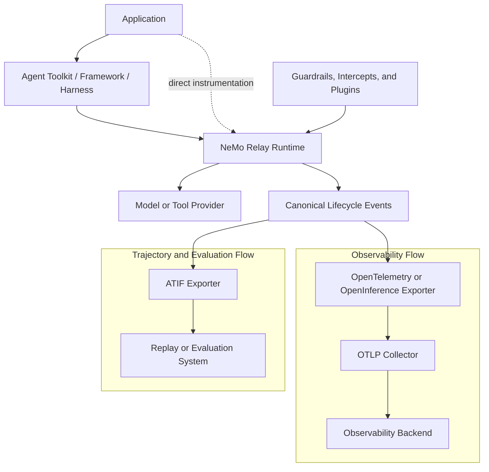

import { MermaidStyles } from "@/components/MermaidStyles";

{/* SPDX-FileCopyrightText: Copyright (c) 2026, NVIDIA CORPORATION & AFFILIATES. All rights reserved.
SPDX-License-Identifier: Apache-2.0 */}

NeMo Relay is the agent execution runtime layer in the NVIDIA NeMo ecosystem. It
does not replace an agent framework, model provider, guardrail authoring system,
or deployment platform. Instead, it gives those systems one shared way to model
execution scopes, lifecycle events, middleware, plugins, adaptive behavior, and
observability around tool and LLM calls.

Use this page to understand where NeMo Relay fits:

- Inside the NVIDIA NeMo software stack
- Inside agent frameworks, harnesses, and provider adapters
- Across the Rust, Python, Node.js, Go, and C FFI bindings in this
  repository

## How NeMo Relay Fits in the NVIDIA NeMo Ecosystem

The NVIDIA NeMo ecosystem spans model development, agent construction,
guardrailing, inference, optimization, and runtime operations. NeMo Relay has a
narrower responsibility: it tracks and controls work across scopes, tools, and
models.

| System | Role | How It Connects to NeMo Relay |
|---|---|---|
| [NVIDIA NeMo Framework](https://docs.nvidia.com/nemo-framework/user-guide/latest/nemotoolkit/index.html) | Build and customize generative AI models. | Applications can instrument calls to models produced with NeMo Framework. Relay does not train or customize the model. |
| [NVIDIA NIM for Large Language Models](https://docs.nvidia.com/nim/large-language-models/latest/introduction.html) | Serve LLM inference through production endpoints. | Relay can observe or control client requests to a NIM endpoint. Relay does not host the endpoint. |
| [NVIDIA Dynamo](https://docs.nvidia.com/dynamo) | Deploy and scale distributed inference services. | Applications can send Relay-managed model calls to a Dynamo-served endpoint. Relay does not schedule or operate the inference workers. |
| [NeMo Agent Toolkit](https://docs.nvidia.com/nemo/agent-toolkit/latest/) and agent application frameworks | Build, run, profile, and optimize agent workflows across tools, data sources, and framework choices. | A framework integration can give Relay tool or LLM callbacks to manage, or emit lifecycle events when the framework invokes the callbacks itself. |
| [NeMo Guardrails](https://docs.nvidia.com/nemo-guardrails/index.html) and policy systems | Define safety, control, and compliance behavior for LLM applications. | Relay can run configured guardrails and intercepts around managed tool and LLM calls while the policy system owns policy authoring. |
| Application harnesses and workflow code | Decide the agent pattern, planner, memory, retries, scheduling, and user-facing behavior. | NeMo Relay instruments the tool and model calls that the harness already invokes. |
| Observability backends | Store and query traces, logs, and metrics. | Relay exporters can project lifecycle events into OpenTelemetry or OpenInference-compatible traces and send them through an OTLP pipeline. |
| Trajectory and evaluation systems | Replay or evaluate completed agent runs. | Relay can project lifecycle events into Agent Trajectory Interchange Format (ATIF) artifacts for offline analysis, replay, or evaluation. |

In practical terms, NeMo Relay answers a different question than higher-level
agent products. A framework asks, "What should the agent do next?" NeMo Relay
asks, "When the agent does work, which scope owns it, which middleware applies,
what events are emitted, and which subscribers can consume the result?"

## How NeMo Relay Relates to Other Tooling

NeMo Relay runs alongside application code while the agent is executing. It
captures scope, tool, and LLM activity and can apply middleware before or around
that work. Telemetry conventions and observability or evaluation products serve
different roles and can be used alongside Relay.

| Tooling | Primary Role | Relationship to NeMo Relay |
|---|---|---|
| [OpenTelemetry GenAI conventions](https://opentelemetry.io/docs/specs/semconv/gen-ai/) | Define common attributes and span conventions for AI telemetry. | Relay captures and controls runtime activity, then can export lifecycle events through its typed OpenTelemetry projections. |
| Langfuse, LangSmith, Arize Phoenix, and other observability products | Store and explore traces or agent runs. | These products do not run the agent's tool or model calls. They consume data from a configured export path. |

Relay is not a replacement for a telemetry standard or an observability backend.
Its role is to make the real execution path observable and controllable before
the resulting lifecycle data is stored, visualized, or evaluated elsewhere.

<MermaidStyles />

The following diagram shows how Relay connects application execution to
observability and evaluation systems.

The dotted path shows that an application can call Relay directly without
adopting a higher-level framework. In the observability flow, Relay projects
events into traces and sends them through an OTLP collector. In the trajectory
flow, Relay writes ATIF artifacts for replay or evaluation.

## How NeMo Relay Fits Agent Frameworks and Harnesses

The agent framework and harness landscape is intentionally mixed. A team might
use NeMo Agent Toolkit, LangChain, LangGraph, an internal orchestration layer, a
provider SDK, or direct application code. NeMo Relay is designed to meet those
systems at tool, model, and lifecycle hooks, so they do not need to use one
common API.

The framework or harness continues to manage:

- Agent orchestration, planning, memory, retries, and scheduling.
- Tool discovery, schemas, and application-visible results.
- Provider clients, authentication, transport, and provider-native objects.
- Public callback signatures and framework-specific behavior.

Relay can receive:

- The scope and parent for work that should be observed.
- A tool or LLM function when Relay can invoke it through managed execution.
- Start and end lifecycle notifications when the framework invokes the function.
- JSON-compatible observability payloads and metadata for events and middleware.

Prefer a managed execution wrapper when a framework lets NeMo Relay invoke the
tool or LLM function. Use explicit lifecycle calls or standalone helpers when
the framework invokes the function but exposes reliable start, finish, or
request transformation hooks.

This arrangement lets subscribers see a consistent scope, tool, and LLM event
stream without changing the framework's public behavior.

Refer to [Integrate into Frameworks](/integrate-into-frameworks/about) to choose
an integration method. Use [Adding Framework Scopes](/integrate-into-frameworks/adding-scopes)
for lifecycle hooks, or [Wrapping Tool Calls](/integrate-into-frameworks/wrap-tool-calls)
and [Wrapping LLM Calls](/integrate-into-frameworks/wrap-llm-calls) when Relay
can invoke the function.
