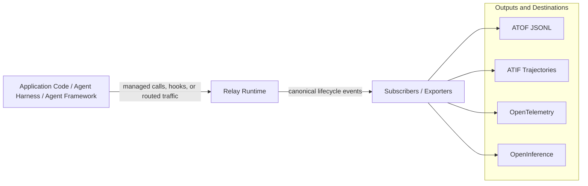

import { MermaidStyles } from "@/components/MermaidStyles";

{/* SPDX-FileCopyrightText: Copyright (c) 2026, NVIDIA CORPORATION & AFFILIATES. All rights reserved.
SPDX-License-Identifier: Apache-2.0 */}

NVIDIA NeMo Relay helps you observe and control what happens inside agent runs
without rewriting the agent stack you already have. It gives coding agents,
applications, framework integrations, middleware, and observability backends a
shared runtime for scopes, policy, plugins, and lifecycle events.

Agent systems usually involve several components in one request: an entry point
starts work, a model is called, tools run, subagents can branch off, and
observability or policy systems need to understand what happened. Relay gives
those components one runtime contract instead of asking each layer to invent
its own wrappers, trace vocabulary, and cleanup rules.

## Integrating With Relay

Relay sits around the work you want to observe or control. Work can be a local
coding-agent session, a request, a turn, an LLM call, a tool call, a subagent
run, or a framework-specific lifecycle unit.

<Note>
Relay does not replace your agent framework, model provider, application logic,
observability backend, or guardrail authoring system. It connects those systems
through shared scopes, middleware, plugins, and lifecycle events.
</Note>

For how Relay complements OpenTelemetry GenAI conventions and observability or
evaluation products, refer to
[How NeMo Relay Relates to Other Tooling](/about-nemo-relay/ecosystem#how-nemo-relay-relates-to-other-tooling).

The first design question is simple: where can Relay observe or control the real
work? The answer determines whether you should use a CLI sidecar, direct SDK
instrumentation, a maintained integration, a framework wrapper, or a plugin.

## Choose Your First Path

Pick the row closest to what you are trying to do.

| Goal | Start With | Why |
|---|---|---|
| Observe Codex or Claude Code locally | [NeMo Relay CLI](/nemo-relay-cli/about) and [Basic Usage](/nemo-relay-cli/basic-usage) | Relay runs as a local sidecar, forwards hooks, routes provider traffic when configured, and writes observability artifacts without changing application code. |
| Instrument application-owned LLM or tool calls | [Instrument Applications](/instrument-applications/about) | Direct SDK instrumentation lets Relay run the complete lifecycle and middleware sequence around callbacks your code owns. |
| Use LangChain, LangGraph, Deep Agents, or OpenClaw | [Supported Integrations](/supported-integrations/about) | Maintained integrations use public framework or plugin APIs to capture supported lifecycle events. |
| Configure traces, trajectories, or raw event export | [Observability](/configure-plugins/observability/about) | Exporters consume the same lifecycle event stream and write ATOF, ATIF, OpenTelemetry, or OpenInference output. |

Hermes Agent understands NeMo Relay plugin configurations. Relay is built into
Hermes Agent without a separate observability plugin or Relay CLI setup.

<Note>
To evaluate a language binding with the smallest complete example, start with
[Quick Start](/getting-started/quick-start).
</Note>

Relay records canonical lifecycle events in Agent Trajectory Observability
Format (ATOF). Exporters can write those events directly as
[ATOF JSONL](/configure-plugins/observability/atof), project completed runs into
[Agent Trajectory Interchange Format (ATIF)](/configure-plugins/observability/atif)
trajectories, or translate them into typed OpenTelemetry output.

## Build on Relay

Use these paths when you need to extend Relay instead of using an existing
feature or integration.

| Goal | Start With |
|---|---|
| Build a framework, host, or provider integration | [Integrate into Frameworks](/integrate-into-frameworks/about) |
| Package reusable exporters, middleware, or policy | [Build Plugins](/build-plugins/about) and [Configure Plugins](/configure-plugins/about) |
| Develop or validate the repository | [Development Setup](/contribute/development-setup) and [Testing and Docs](/contribute/testing-and-docs) |

Rust is the source of truth for runtime behavior. The Python and Node.js
bindings expose the same core model for primary application use. Go and raw C
FFI are experimental and source-first.

### Choose How Relay Connects

Identify where the actual LLM or tool function is invoked. If that invocation
can be routed through NeMo Relay, use managed execution: NeMo Relay runs the
applicable middleware and then invokes the real function. If the framework
retains control but provides before-and-after notifications, translate those
lifecycle hooks into NeMo Relay events. NeMo Relay can then observe the call's
lifecycle but does not execute or control it. If provider-native requests and
responses must be intercepted, route the real provider traffic through the
NeMo Relay gateway and treat NeMo Relay as a production dependency.

<Warning>
Do not add behavior to one primary binding without checking Rust, Python, and
Node.js parity. Public behavior should stay consistent across the supported
bindings.
</Warning>

## Key Features

NeMo Relay offers the following features for agent applications:

- **Events and subscribers** so ATOF events, ATIF trajectories, and typed
  OpenTelemetry output come from the same runtime activity.
- **Scopes** so runs, turns, tools, LLM calls, and subagents have clear
  parent-child relationships, automatic cleanup, and request isolation.
- **Marks** so point-in-time events, such as session starts, compaction, or skill
  loads, do not require a start and end pair.
- **Managed LLM and tool calls** so the same lifecycle and middleware rules
  apply around each callback.
- **Middleware** for the places where Relay must block, sanitize, transform,
  route, retry, or replace execution.
- **Plugins** so reusable observability, guardrail, adaptive, and exporter
  behavior can be turned on from configuration.

Use [Concepts](/about-nemo-relay/concepts) when you want the deeper model for
scopes, events, middleware, subscribers, and plugins.

## Documentation

Use the tasks below to build your understanding and set up Relay:

| Task | Start With |
|---|---|
| Install packages | [Installation](/getting-started/installation) |
| Understand the runtime model | [Agent Runtime Primer](/about-nemo-relay/agent-runtime-primer) |
| Configure plugin files | [Plugin Configuration Files](/configure-plugins/plugin-configuration-files) |
| Export traces or trajectories | [Observability](/configure-plugins/observability/about) |
| Tune performance with adaptive behavior | [Adaptive](/configure-plugins/adaptive/about) |
| Debug trace incidents | [Trace Incident Runbook](/resources/troubleshooting/trace-incident-runbook) |
| Look up symbols | [APIs](/reference/api) |

## How Relay Connects to Your Stack

The diagram shows the external flow from application work through Relay to
observability output. Applications and frameworks keep ownership of their real
payloads and callbacks. Relay records lifecycle events for subscribers and
exporters to consume.

<MermaidStyles />

Configure the output that matches your destination:

- [ATOF JSONL](/configure-plugins/observability/atof) for the canonical event stream.
- [ATIF trajectories](/configure-plugins/observability/atif) for replay, analysis, and evaluation.
- [OpenTelemetry](/configure-plugins/observability/opentelemetry) for OTLP-compatible backends.
- [OpenInference](/configure-plugins/observability/openinference) for OpenInference-compatible tracing.
