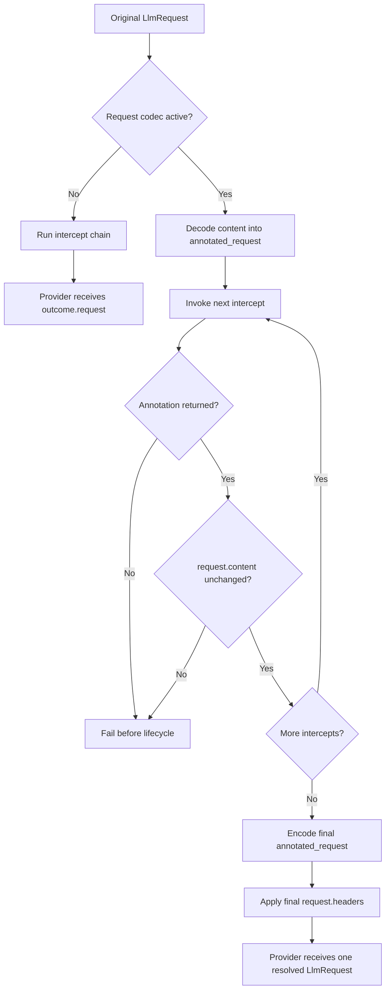

{/* SPDX-FileCopyrightText: Copyright (c) 2026, NVIDIA CORPORATION & AFFILIATES. All rights reserved.
SPDX-License-Identifier: Apache-2.0 */}

An LLM request intercept rewrites a request before managed execution. This page
describes the canonical outcome returned by each intercept, including how Relay
uses it to resolve the provider request and schedule lifecycle marks.

A canonical outcome serialization looks like this:

```json
{
  "request": {"headers": {}, "content": {}},
  "annotated_request": null,
  "pending_marks": []
}
```

`request` is required. `annotated_request` defaults to `null` when omitted on
input, and `pending_marks` defaults to an empty list. Canonical serialization
includes all three fields. A pending mark only contains `name`, optional
`category` and `category_profile`, and optional `data` and `metadata`. Relay
owns event UUIDs, parent UUIDs, and timestamps.

## Request Authority

The provider-body source of truth only depends on whether a request codec is
active:

Request codecs translate provider-specific request payloads into Relay's
normalized annotated request for intercepts, then encode accepted annotated
edits back into the provider request before execution. They normalize the
payload shape rather than translating between providers; response codecs are a
separate response-side path used to attach normalized data to lifecycle events.

| Request codec | Provider body source | Header source |
| --- | --- | --- |
| No codec | `outcome.request.content` | `outcome.request.headers` |
| Active codec | `outcome.annotated_request` | `outcome.request.headers` |

With an active codec, `request.content` is read-only context. Every intercept
must return an annotation and make provider-body changes through that
annotation. Use portable fields such as `messages` and `instructions`, the
tagged `api_specific` surface for modeled provider controls, provider-native
components for provider-only unions, and flattened `extra` only for unknown
future top-level fields. Relay rejects a changed raw body or missing annotation
at the offending intercept before invoking later middleware or creating an LLM
lifecycle.

The `nemo-relay` gateway enables request codecs for the generation routes
`/v1/messages`, `/v1/chat/completions`, and `/v1/responses`, including streaming
requests. Interceptors written for those routes must migrate provider-body
mutation from `request.content` to `annotated_request`. Count-token, model,
probe, and non-LLM passthrough routes retain raw-body authority.

For gateway generation routes, preserve the effective `stream` mode in the
annotation. Relay rejects buffered-to-streaming and streaming-to-buffered edits
before the provider callback because response handling is selected from the
original request.

The following diagram shows how Relay resolves an intercept outcome before
managed execution.



## Binding Contract

The following callbacks return the same logical outcome in their native type
or object shape:

- Python callbacks return `LLMRequestInterceptOutcome`.
- Rust callbacks return `LlmRequestInterceptOutcome`.
- Node.js callbacks return `{ request, annotated?, pendingMarks? }`.
  JavaScript pending-mark DTOs use `categoryProfile`; canonical JSON retains
  `pending_marks` and `category_profile`.
- Public C callbacks return one owned canonical outcome JSON string, and native
  ABI v2 callbacks return one host-owned outcome JSON string.
- Rust and Python `grpc-v1` worker SDKs return their canonical outcome in a
  `JsonEnvelope` with schema `nemo.relay.LlmRequestInterceptOutcome@2`.

The standalone request-intercept helper returns the complete outcome but does
not emit its pending marks because it does not own an LLM lifecycle.

## Managed Lifecycle

Managed execution runs all effective global and scope-local intercepts before
creating the LLM handle. Each accepted request and annotation pair feeds the
next intercept under the authority rules above, while pending marks append in
middleware order. A breaking intercept retains the marks it returned. If any
intercept fails or its boundary result is malformed, Relay discards all
accumulated marks and creates no LLM lifecycle.

After successful interception, Relay creates the handle and captures one
subscriber snapshot. It emits the LLM start at `T`, every pending mark at
`T + 1µs` in returned order with the LLM UUID as parent, and the LLM end no
earlier than `T + 1µs`. Streaming and non-streaming calls use the same rules.
Pending marks are never added to the provider request, annotated request,
codec input, sanitizer input, or start payload.

## Historical 0.6 Migration

This section describes the NeMo Relay 0.6 migration. Relay 0.8 retains the
`grpc-v1` identifier but replaces the tool-result envelope fields with
structured protobuf messages. Rebuild workers, regenerate custom protobuf
bindings, and exclude pre-0.8 Relay versions in `compat.relay`.

This finalizes unpublished native ABI v2 and `grpc-v1` contracts. Rebuild all
development native plugins and workers against the same NeMo Relay release that
hosts them. Replace tuple results, split outputs, metadata envelopes, and
parallel mark-aware registrations with the
canonical outcome and the existing `register_llm_request_intercept`
registration name.

The 0.6 annotation expansion changes the request and outcome envelope schemas
to `nemo.relay.AnnotatedLlmRequest@2` and
`nemo.relay.LlmRequestInterceptOutcome@2`. Rebuild Rust native plugins and Rust
`grpc-v1` workers against NeMo Relay 0.6, and update Python workers to the 0.6
worker SDK. That release required a compatibility range that excluded Relay
0.5. Relay 0.8 supersedes that historical floor for every dynamic plugin:
after rebuilding, declare `compat.relay = ">=0.8.0,<1.0"`, or another range
that excludes Relay versions before 0.8. The host enforces the current
compatibility floor during manifest and registry validation, before loading the
plugin.

For gateway generation requests, replace code such as
`request.content["messages"] = ...` with an edit to
`annotated_request.messages`, then return both the unchanged raw request and the
edited annotation. Header edits continue to use `request.headers`. An attempt
to change the raw body while its request codec is active returns an explicit
error before the provider callback.

## Related Topics

- [Tool Execution Intercept Outcomes](/reference/tool-execution-intercept-outcomes)
- [gRPC Worker Protocol Overview](/build-plugins/dynamic-plugins/grpc-worker/grpc-worker-protocol)
